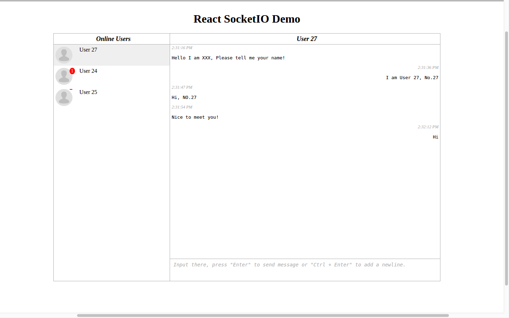

# react-socket-io

[](https://travis-ci.org/charleslxh/react-socket-io)

A react provider for socket.io, http://socket.io/

react-socket-io is compatible with [browserify](http://browserify.org/).

# Installation

```bash
npm install react-socket-io --save-dev
```

# How to use

In app container file:

```js
import React from 'react';
import { Socket } from 'react-socket-io';

const uri = 'http://localhost/test';
const options = { transports: ['websocket'] };

export default class AppContainer extends React.Component {
    constructor(props) {
        super(props);
    }

    render() {
        return (
            <Socket uri={uri} options={options}> 
                { this.props.children }
            </Socket>
        );
    }
}
```

In other files:

```js
import React from 'react';
import { Event } from 'react-socket-io';

export default class MyComponent extends React.Component {
    constructor(props) {
        super(props);
        this.onMessage = this.onMessage.bind(this);
    }

    onMessage(message) {
        console.log(message);
    }

    render() {
        return (
            <div>
                <h1>My React SocketIO Demo.</h1>
                <Event event='eventName' handler={this.onMessage} />
            </div>
        );
    }
}

```

# Related Props

## Socket Component Props

###  uri

Server socket.io uri you want to connect. If you use namespace, refer to [socket.io documentation](http://socket.io/docs/rooms-and-namespaces/)

###  options
- `reconnection` whether to reconnect automatically (`true`)

- `reconnectionAttempts` (`Infinity`) before giving up

- `reconnectionDelay` how long to initially wait before attempting a new
   reconnection (`1000`). Affected by +/- `randomizationFactor`,
   for example the default initial delay will be between 500 to 1500ms.

- `reconnectionDelayMax` maximum amount of time to wait between
   reconnections (`5000`). Each attempt increases the reconnection delay by 2x
   along with a randomization as above

- `randomizationFactor` (`0.5`), 0 <= randomizationFactor <= 1

- `timeout` connection timeout before a `connect_error`
   and `connect_timeout` events are emitted (`20000`)

- `autoConnect` by setting this false, you have to call `manager.open`
   whenever you decide it's appropriate

- `transports` (`Array`): a list of transports to try (in order).
    Defaults to `['polling', 'websocket']`. `Engine`
    always attempts to connect directly with the first one, provided the
    feature detection test for it passes.

- `rememberUpgrade` (`Boolean`): defaults to false.
           If true and if the previous websocket connection to the server succeeded,
           the connection attempt will bypass the normal upgrade process and will initially
           try websocket. A connection attempt following a transport error will use the
           normal upgrade process. It is recommended you turn this on only when using
           SSL/TLS connections, or if you know that your network does not block websockets.

- `rejectUnauthorized` (`Boolean`): If true, the server certificate is verified against the list of supplied CAs. An 'error' event is emitted if verification fails. Verification happens at the connection level, before the HTTP request is sent. Can be used in Node.js client environment to manually specify certificate information.

## Event Component Props

### event

The event name you want to listen.

### handler

A event handler for that event.

# Run Example

The `example` folder contain a basic **socket.io server** , run `npm run-script example` to start server, and then visit `localhost:8090`.



# As a contributer.

1. Clone this project.

    ```bash
    git clone git@github.com:charleslxh/react-socket-io.git
    ```

2. Install third party packages

    ```bash
    npm install
    ```

3. Run gulp

    ```bash
    gulp
    ```

    If you don't have gulp command, Install it globally.
